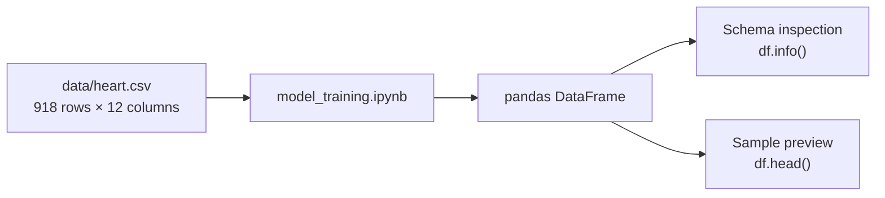

# Heart Disease ML API

[](#current-status)
[](https://colab.research.google.com/github/Sachin-Fernando/mlops-heart-disease-api/blob/main/model_training.ipynb)

An early-stage machine-learning project for exploring a tabular heart-disease dataset and laying the groundwork for a future prediction service.

The repository currently contains the dataset and an exploratory Jupyter notebook. It does **not** yet contain a trained model, inference API, automated tests, container configuration, CI/CD pipeline, or deployment configuration. This README separates the implemented work from the planned MLOps direction so that the project's status is clear.

> [!CAUTION]
> This project is for educational and portfolio purposes only. It is not a medical device and must not be used to diagnose, treat, or make clinical decisions.

## Current status

| Capability | Status | Evidence in the repository |
| --- | --- | --- |
| Dataset | Available | `data/heart.csv` |
| Exploratory notebook | Available | `model_training.ipynb` |
| Data loading and preview | Implemented | pandas loading, `DataFrame.info()`, and `DataFrame.head()` |
| Data preprocessing | Not implemented | No preprocessing pipeline is present |
| Model training or evaluation | Not implemented | No estimator, split, metrics, or evaluation code is present |
| Serialized model | Not available | No model artifact is committed |
| Prediction API | Not implemented | No application or endpoint code is present |
| Docker | Not implemented | No `Dockerfile` or Compose file is present |
| Automated tests | Not implemented | No test files or test configuration are present |
| CI/CD | Not implemented | No workflow configuration is present |
| Deployment | Not implemented | No infrastructure or platform configuration is present |

## Overview

The notebook loads a binary-classification dataset containing 918 records, 11 potential input columns, and the `HeartDisease` target. Its saved output shows all 12 columns as non-null. The target distribution in the committed CSV is:

| Target value | Records |
| --- | ---: |
| `0` | 410 |
| `1` | 508 |

The current implementation stops after inspecting the dataframe schema and first five rows. Despite the repository name, no prediction service is available yet.

## Architecture

The implemented workflow is deliberately small:



There is currently no preprocessing, training, model registry, serving, monitoring, or deployment layer.

## Features

- A committed tabular dataset with 918 records and no blank values.
- Eleven potential predictor columns covering demographic and clinical-style measurements.
- A binary `HeartDisease` target column.
- A Google Colab-compatible Jupyter notebook.
- Basic dataframe inspection using pandas.

### Dataset schema

| Column | Stored type | Observed values or role |
| --- | --- | --- |
| `Age` | Integer | Numeric input |
| `Sex` | Text | `F`, `M` |
| `ChestPainType` | Text | `ASY`, `ATA`, `NAP`, `TA` |
| `RestingBP` | Integer | Numeric input |
| `Cholesterol` | Integer | Numeric input |
| `FastingBS` | Integer | `0`, `1` |
| `RestingECG` | Text | `LVH`, `Normal`, `ST` |
| `MaxHR` | Integer | Numeric input |
| `ExerciseAngina` | Text | `N`, `Y` |
| `Oldpeak` | Float | Numeric input |
| `ST_Slope` | Text | `Down`, `Flat`, `Up` |
| `HeartDisease` | Integer | Binary target: `0` or `1` |

The repository does not currently document the dataset's provenance, licensing terms, collection process, or formal data dictionary. The table above therefore reports only names, types, and values observable in the committed data.

## Tech stack

| Technology | Current use |
| --- | --- |
| Python | Notebook language |
| Jupyter Notebook / Google Colab | Interactive exploration environment |
| pandas | CSV loading and dataframe inspection |
| NumPy | Imported by the notebook, but not yet used in a calculation |

No dependency versions are pinned, and no web framework or machine-learning library is currently used.

## Project structure

```text
mlops-heart-disease-api/
├── data/
│   └── heart.csv              # Committed dataset
├── model_training.ipynb       # Data loading and initial inspection
├── .gitattributes             # Git text-normalization settings
└── README.md                  # Project documentation
```

The repository also currently tracks a `.DS_Store` operating-system metadata file; it is omitted from the functional structure above.

## Local setup

### Prerequisites

- Python 3
- `venv` and `pip`

Clone the project and create an isolated environment:

```bash
git clone https://github.com/Sachin-Fernando/mlops-heart-disease-api.git
cd mlops-heart-disease-api

python3 -m venv .venv
source .venv/bin/activate
python -m pip install pandas numpy jupyter
jupyter notebook model_training.ipynb
```

On Windows PowerShell, activate the environment with:

```powershell
.venv\Scripts\Activate.ps1
```

> [!IMPORTANT]
> The notebook currently calls `pd.read_csv('heart.csv')`, while the committed file is at `data/heart.csv`. Before running the data-loading cell from the repository root, change it to:
>
> ```python
> df = pd.read_csv("data/heart.csv")
> ```

The installation command above reflects the notebook's imports, but it is not a reproducible dependency lock. A future release should add a pinned dependency file.

## Docker usage

Docker is not currently supported because the repository has no `Dockerfile`, Compose configuration, application process, or dependency manifest. There is therefore no valid image-build or container-run command to document yet.

## API examples

There are no API examples in the current version because no HTTP application, route, request schema, response schema, or server command exists in the repository. Adding a sample request now would invent an interface that has not been implemented.

Once an API is added, this section should document its real health and prediction endpoints, validation rules, example payloads, response fields, and error cases.

## Testing

No automated tests or test framework configuration are currently included. The notebook contains saved outputs, but these are not a repeatable test suite.

A production-oriented version should test at least:

- Dataset and request-schema validation.
- Preprocessing consistency between training and inference.
- Model training and serialization.
- Prediction behavior for valid, invalid, missing, and out-of-range inputs.
- API health, success, and error responses.
- Container startup and end-to-end inference.

## CI/CD

No CI/CD workflows are currently committed: there is no `.github/workflows` directory or equivalent pipeline configuration. There are also no deployment manifests or environment definitions.

When the service exists, a suitable pipeline could lint and test each change, build a versioned container image, scan dependencies and the image, and deploy only after the required checks pass. These are roadmap items, not current features.

## Limitations

- The notebook performs only loading and visual inspection; it does not train or evaluate a model.
- The committed dataset path does not match the path currently used by the notebook.
- Dataset provenance, licensing, feature definitions, and intended-use documentation are missing.
- No dependency versions or reproducible environment are defined.
- No preprocessing strategy is implemented for categorical or numeric inputs.
- No data-quality checks address implausible or sentinel numeric values.
- No fairness, subgroup, calibration, robustness, or clinical-validity assessment is present.
- No inference interface, model artifact, tests, container, automation, or deployment configuration exists.
- The repository does not declare a software license.

## Security and responsible use

The current repository does not expose a network service or include authentication, authorization, or secrets. Before any API deployment, the project should add strict input validation, HTTPS, access controls where appropriate, rate limiting, safe error handling, dependency and container scanning, secrets management, audit-friendly logging, and protections against sensitive health information entering logs.

Model artifacts and preprocessing code should be versioned and verified together. Training data, evaluation reports, and dependencies should have documented provenance and integrity controls.

## Medical disclaimer

This repository and dataset are provided for learning and demonstration. They do not provide medical advice and have not been shown to be safe or effective for clinical use. A future model's output would be a statistical estimate, not a diagnosis. Do not use this project to delay care, replace a qualified healthcare professional, or make decisions about a person's treatment. If you have a medical concern, contact an appropriate healthcare professional or emergency service.

## Roadmap

- [ ] Correct the notebook's dataset path and add a pinned dependency specification.
- [ ] Document dataset provenance, licensing, definitions, and intended use.
- [ ] Add repeatable data validation and exploratory analysis.
- [ ] Build a preprocessing pipeline for numeric and categorical columns.
- [ ] Train baseline models using a leakage-safe split and cross-validation.
- [ ] Report appropriate classification, calibration, subgroup, and robustness metrics.
- [ ] Persist a versioned preprocessing-and-model artifact with a model card.
- [ ] Implement a typed prediction API with documented validation and error behavior.
- [ ] Add unit, integration, and end-to-end tests.
- [ ] Package the application in a minimal, non-root container.
- [ ] Add CI checks, security scanning, and a documented deployment workflow.
- [ ] Add production observability, drift monitoring, and a rollback strategy.

## Contributing

Contributions should keep documentation aligned with code that is actually present. When adding a capability, include its tests and update the status table, setup instructions, and examples in the same change.
